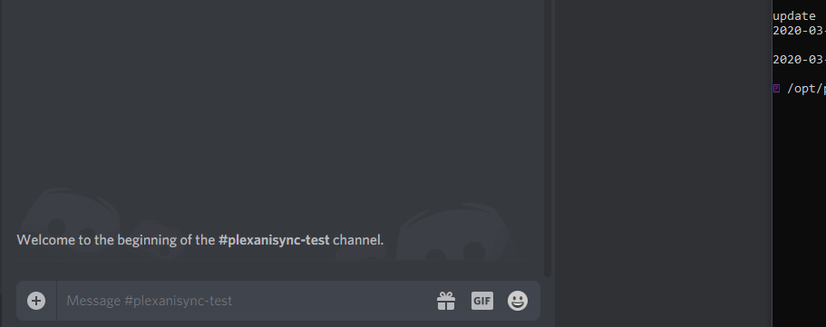

[](https://travis-ci.org/RickDB/PlexAniSync)
[](https://hub.docker.com/r/rickdb/plexanisync) 
[](https://www.python.org/) 
[](https://github.com/RickDB/PlexAniSync/blob/master/LICENSE) 

---

- [Introduction](#introduction)
- [Demo](#demo)
- [Requirements](#requirements)
- [Installation](#installation)
    - [1. Base Install - Linux](#1-base-install-linux)
    - [2. Bae Install - Windows](#2-base-install-widows)
    - [3. Authenticate Home User(s) (optional)](#3-authenticate-home-users-optional)
- [Configuration](#configuration)
    - [Sample Configuration](#sample-configuration)
    - [Core](#core)
- [Notifications](#notifications)
    - [Apprise](#apprise)
    - [Pushover](#pushover)
    - [Slack](#slack)
- [Optional features](#Optional features)
    - [Custom settings file location](#Custom settings file location)
    - [Make Plex watched episode count take priority](#Make Plex watched episode count take priority)
    - [Skip list updating for testing](#Skip list updating for testing)
    - [Tautulli Sync Helper script](#Tautulli Sync Helper script)
    - [Docker](#Docker)
- [Usage](#usage)
  - [plex](#plex)
- [Examples (CLI)](#examples-cli)
    - [direct](#direct-connection)
    - [myplex](#myplex-connection)
    - [sync-now](#sync-now)
- [Support](#Support)
- [Planned](#Planned)

---

# Introduction

If you manage your Anime with Plex this will allow you to sync your libraries to [AniList](https://anilist.co)  , recommend using Plex with the [HAMA agent](https://github.com/ZeroQI/Hama.bundle) for best Anime name matches.

Unwatched Anime in Plex will not be synced so only those that have at least one watched episode, updates to AniList are only send with changes so need to worry about messing up watch history.


This version is based on my previous project  [PlexMalSync](https://github.com/RickDB/PlexMALSync) which due to MAL closing their API is no longer working, this might change in the future and if it does will resume working on that again as as well.


**If you want test it out first without updating your actual AniList entries check out ``Skip list updating for testing `` from the ``Optional features`` section of this readme**

# Demo
### PlexAniSync
Click to enlarge.

[](https://asciinema.org/a/306779)

### Discord Notification




# Requirements

1. Debian OS (can work with other operating systems as well).

2. Python 3.6+

3. Required Python modules.

# Installation
#1-base-install-linux

Installs PlexAniSync to the system so that it can be ran with the `PlexAniSync` command.

1. Clone the PlexAniSync repo.
   
   ```
   sudo git clone https://github.com/RickDB/PlexAniSync /opt/PlexAniSync
   ```

1. Fix permissions of the `PlexAniSync` folder (replace `user`/`group` with your info; run `id` to check).
   
   ```
   sudo chown -R user:group /opt/PlexAniSync
   ```

1. Go into the `PlexAniSync` folder.
   
   ```
   cd /opt/PlexAniSync
   ```

1. Install Python and PIP.
   ```
   sudo apt-get install python3 python3-pip
   ```
   
1. Install the required python modules.
   
   ```
   sudo python3 -m pip install -r requirements.txt
   ```

1. Create a shortcut for `PlexAniSync`.
   
   ```
   sudo ln -s /opt/PlexAniSync/PlexAniSync.py /usr/local/bin/PlexAniSync
   ```
 
1. Generate a basic `config.json` file.
   
   ```
   PlexAniSync plex -c direct
   ```
 
1. Configure the `config.json` file.
 
   ```
   nano config.json
   ```
   
#2-base-install-widows 
 
1. Get the latest version using your favorite git client or by downloading the latest release from here:
   ```
    https://github.com/RickDB/PlexAniSync/archive/master.zip
   ```
1. Make sure you have Python 3 installed:

    [Python homepage](https://www.python.org/)

1. Head over to the downloaded folder then open CMD or PowerShell then `cd` into your directory copy and paste the path into cmd/powershell
    
   ```
   cd C:\Users\username\path\to\file\PlexAniSync-master
   ```
 
1. Install the required python modules.
   
   ```
   pip3 install -r requirements.txt
   ```
   or
   ```
   pip install -r requirements.txt
   ```
1.  Generate a basic `config.json` file.   
    
   ```
    python .\PlexAniSync.py plex -c direct
   ```
   
1. Configure the `config.json` file using your favorite editor such as notepad++ and etc
   
   ```
   config.json
   ```
#3-authenticate-home-users-optional
 
1. You can use `myplex` connection method to sync your home users library as well. there is 2 way to sync home user one is by using the config file and give the `homne_username` the other one by giving the username in the cli.
   
   CLI Method
   ```
   python PlexAniSync.py -c myplex -h testuser --sync-now
   ```
   
   by invoking 
   
   ```
    python PlexAniSync.py plex --help
   ```
   you will be able to see the options for using plex
   `-c` : Connect method 
   `-h` : will use this home username instead of the config file one.
   `--sync-now`: will start syncing

# Configuration
## Sample Configuration
```json
{
  "ANILIST": {
    "access_token": "",
    "plex_episode_count_priority": false,
    "skip_list_update": false,
    "username": ""
  },
  "Direct_IP": {
    "base_url": "",
    "token": ""
  },
  "MyPlex": {
    "home_server_base_url": "",
    "home_user_sync": false,
    "home_username": "",
    "myplex_password": "",
    "myplex_user": "",
    "server": ""
  },
  "PLEX": {
    "anime_section": "",
    "authentication_method": "direct"
  },
  "core": {
    "debug": false
  },
  "notifications": {
    "Apprise": {
      "service": "apprise",
      "url": "",
      "title": ""
    },
    "pushover": {
      "service": "pushover",
      "app_token": "",
      "user_token": "",
      "priority": 0
    },
    "slack": {
      "service": "slack",
      "webhook_url": ""
    },
    "verbose": true
  }
}
```
## Core
```json
  "core": {
    "debug": false
  },
```

`debug` - Toggle debug messages in the log. Default is `false`.

  - Set to `true`, if you are having issues and want to diagnose why.

## ANILIST
```json
"ANILIST": {
    "access_token": "",
    "plex_episode_count_priority": false,
    "skip_list_update": false,
    "username": ""
  },
```
You will need `access_token` which can be grab using  from https://anilist.co/api/v2/oauth/authorize?client_id=1549&response_type=token
_Note: Make sure to copy the entire key as it is pretty long and paste that in the config file under `access_token` make sure to enclose it._

Afterwards make sure to also fill in your AniList username as well which is your actual username not your e-mail address like for example:
```json
"ANILIST": {
    "access_token": "iLikeToastyGoblins",
    "username": "Netsplite"
  },
```

## Direct_IP
```json
"Direct_IP": {
    "base_url": "",
    "token": ""
  },
```
you can use direct IP to connect to Plex Server you just need the base_url  by default it should be `http://127.0.0.1:32400` if the server is a local machine. 

Then you can grab the toke by following this https://support.plex.tv/articles/204059436-finding-an-authentication-token-x-plex-token/

_Note: This is quite advance and it's recommended to use myplex method but if you feel ballsy then go ahead._

## MyPlex
```json
"MyPlex": {
    "home_server_base_url": "",
    "home_user_sync": false,
    "home_username": "",
    "myplex_password": "",
    "myplex_user": "",
    "server": ""
  },
```
Myplex method is one of the easiest way to connect all you have to do is insert `myplex_password` which is your plex password. 
then just pass the `myplex_user` which will be your username for Plex

If you want to sync home user then set `home_user_sync` to `true` and fill in `home_username`, `home_server_base_url` 
which should be the same with the `base_url` then the Plex `server` name.

Also For MyPlex authentication you will need your Plex server name and Plex account login information, for example:

```json
"MyPlex": {
    "home_server_base_url": "http://127.0.0.1:32400",
    "myplex_password": "TooOpAlwaysWin",
    "myplex_user": "Goku",
    "server": "RemBestWaifu"
  },
```
This completes the MyPlex authentication 

_Note: Again if you want to sync againts home user which is not the admin then just fill in the rest and set `home_user_sync` to `true`._

## PLEX

```json
"PLEX": {
    "anime_section": "",
    "authentication_method": "direct"
  },
```
**THIS IS REALLY IMPORTANT SPECIALLY `anime_section`** you will need to specify which library you have your Animes, Otherwise it will fail to work.
**Also you will need to set the authentication method either `direct or myplex` choose one otherwise it will throw an error.**
Multiple libraries are now supported and you separate them by using the pipeline ("|") character like so:

```json
"PLEX": {
    "anime_section": "Weeb|HomeWork",
    "authentication_method": "direct"
  },
```

## Notifications

```json
"notifications": {
  "Apprise": {
    "service": "apprise",
    "url": "",
    "title": ""
  },
  "verbose": false
},
```

Notification alerts for PlexAniSync tasks using apprise and etc you can send notification directly to the discord server. 

For manual (i.e. CLI) commands, you need to add the  `--notifications` flag.

Supported `services`:
 - `apprise`
 - `pushover`
 - `slack`

_Note: The key name can be anything, but the `service` key must be must be the exact service name (e.g. `pushover`). See below for example._


```json
"notifications": {
  "anyname": {
    "service": "pushover",
  }
},
```

### General

`verbose` - Toggle detailed notifications.

  - Default is `true`.

  - Set to `false` if you want to reduce the amount of detailed notifications (e.g. just the total vs detailed log).

```json
"notifications": {
  "verbose": true
},
```


### Apprise

```json
"notifications": {
  "Apprise": {
    "service": "apprise",
    "url": "",
    "title": ""
  },
  "verbose": false
},
```

`url` - Apprise service URL (see [here](https://github.com/caronc/apprise)).

 - Required.

`title` - Notification Title.

 - Optional.

 - Default is ` ` is empty.
 
 ### Pushover

```json
"notifications": {
  "pushover": {
    "service": "pushover",
    "app_token": "",
    "user_token": "",
    "priority": 0
  },
  "verbose": false
},
```

`app_token`  - App Token from [Pushover.net](https://pushover.net).

 - Required.

`user_token` - User Token from [Pushover.net](https://pushover.net).

 - Required.

`priority` - [Priority](https://pushover.net/api#priority) of the notifications.

 - Optional.

 - Choices are: `-2`, `-1`, `0`, `1`, `2`.

 - Values are not quoted.

 - Default is `0`.

### Slack

```json
"notifications": {
  "slack": {
    "service": "slack",
    "webhook_url": "",
    "channel": "",
    "sender_name": "Traktarr",
    "sender_icon": ":movie_camera:"
  },
  "verbose": false
},
```

`webhook_url` - [Webhook URL](https://my.slack.com/services/new/incoming-webhook/).

 - Required.

`channel` - Slack channel to send the notifications to.

 - Optional.

 - Default is blank.

`sender_name` - Sender's name for the notifications.

 - Optional.

 - Default is `Traktarr`.

`sender_icon` - Icon to use for the notifications.

 - Optional.

 - Default is `:movie_camera:`


# Optional features

## Custom anime mapping

You can manually link a Plex title and season to an AniList ID, to do so:

- From the project folder copy `custom_mappings.ini.example` to `custom_mappings.ini`
- Add new entries there in the following format:

`Plex title for series`^`Plex season`^`AniList series ID`

As shown above the values are separated by a ^

- To find out the AniList ID you can visit the series page and copy it from the site url, like for example My Shield hero has ID 99263:

https://anilist.co/anime/99263/Tate-no-Yuusha-no-Nariagari

- You can remove any existing entries from the example file as they are purely instructional
- Upon startup it will list all valid custom mappings, incorrect onces are shown as errors and are skipped

## Custom settings file location

If you want to load a different settings.in file you can do so by supplying it in the first argument like so:

`python PlexAniSync.py settings_alternate.ini`

In case of the Tautulli sync helper script you can do as well, first argument will then be settings filename and second will be the series name like so:

`python TautulliSyncHelper.py  settings_alternate.ini <plex show name>`

## Make Plex watched episode count take priority

By default if AniList episode count watched is higher than that of Plex it will skip over, this can be overriden with the setting `plex_episode_count_priority`

When set to True it will update the AniList entry if Plex watched episode count is higher than 0 and will not take into account the AniList watched episode count even if that is higher.

**Use this with caution as normally this isn't required and only meant for certain use cases.**

## Skip list updating for testing

In your settings file there's a setting called `skip_list_update` which you can set to True or False, if set to True it will **NOT** update your AniList which is useful if you want to do a test run to check if everything lines up properly.

## Tautulli Sync Helper script

In the project folder you will find `TautulliSyncHelper.py` which you can use to sync a single Plex show to AniList for use in Tautulli script notifcations (trigger on playback stop).

Usage is as follows:

`python TautulliSyncHelper.py <plex show name>`

Depending on your OS make sure to place the show name between single or double quotes, for more information see the wiki page:

https://github.com/RickDB/PlexAniSync/wiki/Tautulli-sync-script

## Docker

There's also a Docker version based on [Thundernerd's](https://github.com/Thundernerd) which you can find here:

[Docker](https://hub.docker.com/r/rickdb/plexanisync)

If you are still on the Thundernerd docker image recommend switching to this one as it will be kept in sync with latest PlexAniSync changes.


## usage
```
python .\PlexAniSync.py
```

```
Usage: PlexAniSync.py [OPTIONS] COMMAND [ARGS]...

  Plex Anilist sync. Sync animes from plex server to Anilist

Options:
  --version         Show the version and exit.
  --config PATH     Configuration file  [default:
                    C:\Users\Black\Documents\GitHub\PlexAniSync\config.json]
  --cachefile PATH  Cache file  [default:
                    C:\Users\Black\Documents\GitHub\PlexAniSync\cache.db]
  --logfile PATH    Log file  [default:
                    C:\Users\Black\Documents\GitHub\PlexAniSync\activity.log]
  --help            Show this message and exit.

Commands:
  plex  Plex Connection Method (direct or myplex)
```

### plex 
```
python .\PlexAniSync.py plex --help
```

```
Usage: PlexAniSync.py plex [OPTIONS]

  Plex Connection Method (direct or myplex)

Options:
  -c, --connect-method TEXT  Connect Plex using Direct method use which one you want to use such
                             as direct or myplex  [required]
  -h, --home-username TEXT   Connect to home user with this user name.
  --notifications            Send notifications.  [default: False]
  --sync-now                 Immediately start syncing Animes  [default: False]
  --help                     Show this message and exit.
```
`-c`, `--connect-method` -  This will be between `direct` or `myplex` make sure it reflect to the config file otherwise will throw an error. This argument is required.
`-h`, `--home-username` -  This is only need to be passed if you want to sync the home user but don't want to bother going back to config and change it instead just pass the username. This argument is not required.
`--notifications` - giving this parameter like including it will enable push notifications. not required by default is false.
`--sync-now` - Will sync the Anime list immediately without passing this argument it's just going to authenticate you good for testing if you are connected to the server. required if you want sync otherwise it won't initiate.
## examples-cli
### direct-connection

```
python .\PlexAniSync.py plex -c direct
```

This will start direct connection and end after authenticating use it for testing or troubleshooting.

### myplex-connection

```
python .\PlexAniSync.py plex -c myplex
```
This will start myplex connection and end after authenticating use it for testing or troubleshooting.

### sync-now

```
python .\PlexAniSync.py plex -c direct --sync-now --notifications
```

This will start direct connection to plex and starts syncing + sends notification to the desired service in the config file.


## Support

Support thread is located on AniList:

https://anilist.co/forum/thread/6443

Optionally also on Plex forums but less active there:

https://forums.plex.tv/t/plexanisync-sync-your-plex-library-to-anilist/365826

## Planned

Currently planned for future releases:

- [ ] Ignore anime list support (based on content rating and / or title)
- [ ] Improve error handling

## Credits

[Python-PlexAPI](https://github.com/pkkid/python-plexapi)
